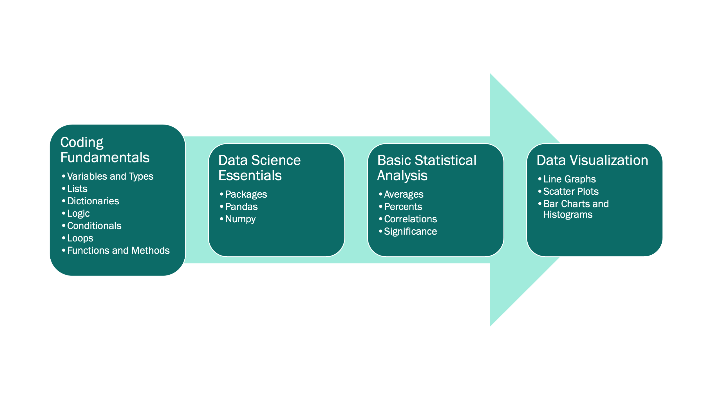

# Summary

<!-- pasted from our PyCon 2020 talk proposal -->
We are bioinformatics trainees at the University of Michigan who started a
local chapter of Girls Who Code to provide a fun and supportive environment for
high school women to learn the power of coding.
Our goal was to cover basic coding topics and data science concepts through
live coding and hands-on practice.
However, we could not find a resource that exactly met our needs. Therefore, over the past
three years, we have developed a curriculum and instructional format using
Jupyter notebooks to effectively teach introductory Python for data science.
This method, inspired by The Carpentries organization, uses bite-sized lessons
followed by independent practice time to reinforce coding concepts, and
culminates in a data science capstone project using real-world data.
We believe our open curriculum is a valuable resource to the wider education
community and hope that educators will use and improve our lessons, practice
problems, and teaching best practices.
Anyone can contribute to our educational materials [on GitHub](https://github.com/GWC-DCMB).

# Statement of Need

As women bioinformatics trainees at the
University of Michigan (U-M), we experience the gender gap in our field first-hand.
During the 1974-1975 academic year, women achieved 18.9% of total Bachelor's
degrees in computer and information sciences in the US [@nces_digest_2012].
By 1983-1984 this peaked at 37.1%, but fell to 17.6% by 2010-2011. We also see this
national trend in the training of the next generation of Bioinformaticians at
Michigan Medicine.
Since accepting its first students in 2001, the U-M Bioinformatics Graduate
Program has graduated 66 male and 22 female doctorates as of 2019.
This disparity begins at the applicant level; during 2016-2019 the average
percentage of females applying directly to the Bioinformatics PhD program was
35.2%, and the average percentage of female applicants listing Bioinformatics as first or second
choice in the Program in Biomedical Sciences, U-M's biomedical PhD umbrella
program was 41%.

Previous research on women's educational experiences in science, technology, engineering,
and mathematics (STEM) have produced
various explanations for persistent gender disparities
[@benbow_gender_2016].
One explanation is that women often experience stereotype threats that
negatively influence their math and science performance and deter them from
pursuing STEM as a career [@hill_why_2010].
The majority of our organization's founding graduate students (all women) began
coding in our undergraduate careers or later.
We wanted to provide a safe place for local high school women to
develop confidence in themselves and their computational skills
before college, and be exposed to successful women role models in STEM to counter negative
stereotypes.

Girls Who Code, a national organization whose mission
is to close the gender gap in technology
[@saujani_girls_2015], was founded in 2012.
Because of our personal experiences and the paucity of women in our field
[@nces_digest_2012; @bonham_women_2017], we began a Girls Who Code student
organization at the University of Michigan in 2017.
For the past four academic years we have registered annually as a recognized
Girls Who Code Club because the national organization provides name recognition,
curriculum resources, guidance for a Capstone Impact Project, and a framework
for launching a coding club.
Participants in the Club attend weekly meetings at the University of Michigan (when
the club is run in person rather than virtually), and are thus largely high school
women from the Ann Arbor area.
In 2019 we launched our own summer program, the Data Science Summer Experience.
When held in person, the Summer Experience
is hosted in Detroit to provide the opportunity
for high school women outside of Ann Arbor to learn coding skills in an inclusive environment.

The national Girls Who Code organization provides a curriculum that teaches
website and application development through programming languages like HTML and
Java; however, our biomedical science graduate students generally have limited
experience with these languages and with web development.
In contrast, many of us have extensive experience performing data science
using the Python programming language.
Data Scientist was rated the #1 job in America by Glassdoor in 2016-2019, #3 in
2020, and #2 in 2021 [@stansell_breaking_2019].
Furthermore, Python is the most popular programming language according to the PYPL
PopularitY of Programming Language Index [@noauthor_pypl_nodate].
Therefore, we believe career exploration in data science using the Python programming
language will optimally prepare our students for careers that provide financial stability and upward economic mobility.
By leveraging the data science expertise of our Club facilitators, we created a
specialized curriculum focused on computational data science in the Python
programming language.

Girls Who Code encourages participants to learn programming skills while working
on an Impact Project website or application throughout the Club
[@hq_gallery_2021].
We created an open source Data Science curriculum that teaches the requisite
Python and statistics skills to complete a Capstone Project, where students explore,
analyze, and present a data set of their choosing.
Using this curriculum, we employ participatory live coding as used by The
Carpentries, which is an effective method that engages learners
[@wilson_software_2016; @nederbragt_ten_2020].
Using paired activities, our curriculum follows the "I do, we do, you do"
didactic paradigm [@fisher_better_2013].
We provide open source resources for both in-person and virtual versions of our
curriculum, including videos corresponding to each lesson.
While we developed this curriculum for our Girls Who Code Club and Summer
Experience, we believe that it can be widely used for teaching introductory
coding for data science.

# Collaborative Curriculum Development

We assembled a team of volunteers involved in our club to develop a custom
curriculum to teach introductory Python for data science via live coding.
We chose the content based on what our students would need to learn
to complete a small data analysis project and communicate their findings
to their peers.
We divided the content by topic into Jupyter notebooks for each lesson, with
each lesson taking approximately 15-20 minutes to teach via live coding.
Every lesson has a corresponding practice notebook with additional exercises on
the same content taught in the lesson, but using different data or variables.
We hosted the curriculum notebooks in a public GitHub repository to facilitate
collaborative development and peer review using pull requests.
In the initial curriculum drafting phase, developers were assigned lesson and
practice notebooks to write.
Once the draft of a lesson was completed, the writer opened a pull request and
asked for review from a different developer.
The reviewer then provided feedback and approved the pull request to be merged
into the main branch after the writer made any requested changes.
This way, more than one person viewed each notebook before it could be
incorporated into the public curriculum, which reduced mistakes and ensured
higher quality content. <!-- TODO: cite U-M Carpentries paper for the development model once it's submitted to bioRxiv?-->
While teaching from the curriculum at the first Data Science Summer Experience,
instructors took notes on their experience and made revisions afterward.
Maintainers continue to monitor the repository and resolve issues as they arise.

Following the onset of the COVID-19 pandemic, we quickly pivoted our club to a
virtual format.
In preparation for the 2020 Summer Experience, we switched to a flipped
classroom style following feedback from our club participants that it was too
difficult to follow along live coding via Zoom.
We recorded facilitators teaching the lesson notebooks as if they were live
coding, then shared them along with a link to the lesson notebooks for students
to code along with while watching the videos.
Each video shows the Jupyter notebook alongside the facilitator themselves
teaching.
This format allowed students to learn at their own pace, then ask questions and
practice when we met together virtually.

Our Jupyter notebooks and links to the lesson videos can be accessed on GitHub:
https://github.com/GWC-DCMB/curriculum-notebooks

# Curriculum

Our curriculum was designed for high school students with no prior coding
experience who are interested in learning Python programming for data science.
However, this course material would be useful for anyone interested in
teaching or learning basic programming for data analysis.

Our curriculum features short lessons to deliver course material in “bite sized”
chunks, followed by practices to solidify the learners' understanding.
Pre-recorded videos of lessons enable effective virtual learning and flipped classroom approaches.

## Learning Objectives

Our learning objectives are:

1. Understand fundamental concepts and best practices in coding.
2. Apply data analysis to real world data to answer scientific questions.
3. Create informative summary statistics and data visualizations in Python.

These skills provide a solid foundation for basic data analysis in Python and
participation in our program exposes students to the many ways coding and
data science can be used to make large impacts across many disciplines.

## Course Content

Our curriculum design consists of 27 lessons broken up into 5 modules that cover Jupyter notebook setup,
Python coding fundamentals, use of essential data science packages including
pandas and numpy, basic statistical analyses, and plotting using seaborn and
matplotlib (Figure 1) [@harris_array_2020; @waskom_seaborn_2021;
@hunter_matplotlib_2007].
Each lesson consists of a lesson notebook, used for teaching
the concept via live coding, and a practice notebook containing similar
exercises for the student to complete on their own following the lesson.

Each lesson builds on those before it, beginning with relevant content reminders
from the previous lessons and ending with a concise summary of the skills
presented within.
As they progress through the curriculum, the students begin simultaneously
working on a data science project using a real world
dataset of their choosing.
While more time is dedicated to lessons early in the program, the formal
curriculum tapers off until the students are solely applying their skills to the
data science project.  
Through this Capstone Project, learners gain practical experience with each
skill as they learn it in the lessons; including importing and cleaning data,
data visualization, and basic statistical analyses.

## Instructional Design
<!-- teaching philosophy / pedagogy -->

We modeled our instructional design in the style of Software Carpentry [@wilson_software_2016].

1. Each lesson begins with a recapping of the relevant core skills presented in
the previous lessons.
1. All lessons are designed to be taught via 15-minute live-coding sessions,
where students type and run code in their own notebooks along with the
instructor in real time. As in Software Carpentry, we find this to be a highly
effective method of teaching coding, since students must actively engage with
the material and deal with errors and bugs as they come up.
1. Each lesson ends with a summary of core skills presented within the material.
1. Each short lesson is also accompanied by a subsequent 10-minute independent
practice, providing further opportunity for practical experience implementing
the coding skill at hand and testing students' understanding of the content.

This curriculum was originally developed for in-person instruction, but the
onset of the COVID-19 pandemic necessitated restructuring to a virtual format.
To better facilitate virtual instruction, we switched to a flipped classroom
style based on feedback from our club participants that it was too difficult to
follow along with live coding via Zoom.
We provide video recordings of instructors going through the Jupyter notebooks
as if they were live coding in the classroom.
Students then watch the lessons and complete the practice exercises prior to
virtual meetings, in which they have the opportunity to ask questions on
material they did not understand and go over the practice exercises.
This virtual format is especially beneficial because it 1) allows students to
learn at their own pace, and 2) enables dissemination of our curriculum to a
wider audience interested in learning introductory Python programming for data
science.

For both in-person and virtual instruction, once students have completed the
Fundamentals module and reach the Data Science Essentials module they begin
simultaneous work on their data science projects.
Projects are completed in a paired programming style, where partners take turns
assuming the “driver” (i.e. the typer) and “navigator” (i.e. the helper) roles
[@hannay_effectiveness_2009].
Switching off in this way helps both partners assume equal responsibility for
the project workload, but more importantly it enables improved knowledge
transfer through peer-to-peer learning.

In addition to our coding curriculum, another key component of our programming
is hosting women guest speakers from diverse fields across academia and
industry.
Our guest speakers come to discuss the journey they have taken to their career
paths as well as how they utilize programming and data science in their jobs.
These varied perspectives are extremely valuable to our learners as they provide
several practical examples of programming careers in the real world, and expose
them to successful women in STEM.

## Experience of Use

We have used this curriculum to teach the Data Science Summer Experience and
Girls Who Code Club in person in 2019 and virtually in 2020-2021.
For the in-person instances, we taught the curriculum through participatory live
coding, a technique we learned from [The Carpentries](https://carpentries.org/)
where the instructor types and explains the code while the learners follow along
in real time.
For the virtual instances, we used a flipped classroom approach where the
learners explore the material individually before meeting together.
Learners watch videos of instructors explaining the material through "live"
coding and follow along.
Learners then complete a practice notebook corresponding to the lesson.
Facilitators then spend the meeting time answering questions and reviewing the core
concepts in the practice notebook.
For both in-person and virtual instances, we had several facilitators present at
each session to answer questions and help learners debug.
Furthermore, one or two facilitators were assigned to each project group to help
learners define data analysis questions, develop and execute a data analysis
plan, visualize and communicate their findings, and troubleshoot coding
problems. The culmination of the project is a presentation to peers, facilitators,
and family members. Through this process learners gain hands-on experience
coding, cleaning data, performing statistical analyses, creating informative data
visualizations, and communicating their results to others.
Projects have ranged from investigating exoplanets to studying the
genomics of psoriasis.

We credit the success of our curriculum not only to the skill of the
instructors, but also to the way we organized and executed the lessons and
project:

1. The instructors and learners used [Google Colaboratory
(Colab)](https://colab.research.google.com/) to write and execute code in
Jupyter notebooks. We chose this option because learners do not have to install
any programs to use Google Colab, and you can easily open and edit the Jupyter
notebooks from GitHub.  When meeting in person, most learners use Google
Chromebooks which have limited programming capabilities, but easy use of a web
browser.
1. Assigning facilitators to groups allowed learners to build a more personal
connection with their facilitators, making them feel more comfortable asking
questions.
1. Group projects were performed using paired programming to allow learners to
collaborate and learn from each other.
1. We used the "sticky note" system from The Carpentries by which learners can
ask for help by putting up a colored sticky note (or a Zoom emoji in the case of
virtual meetings) [@becker_responding_2016].
1. We exposed the learners to different aspects of data science by bringing in
women guest speakers from academics and industry. This allowed them to better
put what they were learning into context, think about how they might use the
skills they were learning in potential future careers, and exposed them to
successful women in STEM.

### Learner experiences

We surveyed learners anonymously after each Club and Summer Experience and found
that they all felt their skills in Python programming,
problem solving, critical thinking, and collaboration had improved.
Furthermore, for the 2019 instance of Club we asked that all participants take a
pre-test and a post-test comprising Python coding questions.
While only five participants recorded their post-test, all of them answered more
questions correctly on the post-test than the pre-test (range 1-8 more questions
correct out of 11).

On a 10 question skills assessment, the average increase in correct answers between the first 2019 club meeting and the last 2020 club meeting was 4.2 with a standard deviation of 2.8 (N=5 respondents). Fifty-two percent of the 2019 Detroit Summer Experience in Data Science learners (N=19) did not have experience with Python programming. Afterwards, on a 5 point scale from 'Not at all' to 'Definitely',' the average answer for  ‘Do you feel like you’ve improved your Python programming skills?’ was 4.6 (standard deviation [s.d.]=1), with 4.2 (s.d.=0.9) for ‘Do you feel like you’ve improved your problem solving and critical thinking skills,’ and 4.0 (s.d.=0.9) for ‘Do you feel like this experience helped you gain self-confidence?' In a survey of Club and Summer Experience alumni, 75% (N=20) want to pursue a STEM career. 62% (N=21) are still coding. On a 5-point scale from strongly 'Disagree' to 'Strongly Agree,' the average answer for ‘My participation in GWC impacted my career aspirations’ is 4 (s.d.=0.9), with 4.5 (s.d.=0.6) for ‘Participating in GWC made me feel more confident in analyzing data’ and 3.9 (s.d.=1) for ‘Participating in GWC made me more confident in myself.’

Overwhelmingly, learners' favorite parts of the program are the guest speakers
and the project.
These aspects of our curriculum expose them to new fields and allow them to
apply their newfound coding skills to asking an interesting question.
A 2021 Club learner shared, "I plan to go to college for Computer Science and get a robotics minor when my college offers it. GWC has inspired me to consider pursuing a Masters or PhD in CS as well as take some electives in Data Science.” Five of our 86 alumni have gone on to perform research with U-M faculty members, with one presenting her work at an international conference. 
In fact, about a third of participants claim that they are now more interested in
pursuing a career in computer or data science compared to before their Girls Who
Code experience.

# Acknowledgements

We would like to acknowledge our faculty co-sponsors Maureen Sartor &
Cristina Mitrea.
We appreciate the continued support of U-M DCMB staff and faculty including
Julia Eussen, Mary Freer, Linda Peasley, Jane Wiesner, Brian Athey, and
Margit Burmeister.
We are grateful for the resources provided by the national Girls Who Code
organization.

Our programming is made possible by the dedication of past and present Executive
Committee members, Club and Summer Experience Facilitators, and Capstone Project
mentors including
Shweta Ramdas, Alex Weber, Arushi Varshney, Sophie Hoffman, Hojae Lee, Ruma
Deb, Saige Rutherford, Michelle McNulty, Bailey Peck, Chloe Whicker, Carolina
Rojas Ramirez, Verity Sturm, Zoe Drasner, Sarah Latto, Emily Roberts, Angel Chu,
Vivek Rai, Hillary Miller, Ashton Baker, Murchtricia Jones, Lauren Jepsen,
Aubrey Annis, Awanti Sambarey, Mengtong Hu, Maribel Okiye, Yingxiao Zhang, and
Neslihan Bisgin.

We are grateful for the funding and other support provided to our
student organization from the following sponsors:
the U-M Department of Computational Medicine and Bioinformatics,
the U-M Department of Biostatistics,
the U-M Department of Statistics,
the U-M Office of Graduate and Postdoctoral Studies,
the U-M Endowment in Basic Sciences,
the U-M Detroit Center,
the U-M Life Sciences Institute,
the U-M Office of Research,
the Michigan Council of Women in Technology Foundation,
DELL Technologies,
Cisco Systems,
Zingerman’s Delicatessen,
the Girls Who Code Support Fund,
and anonymous donations from Giving Blue Day 2019.

We also thank the students who have participated in our Club and Summer
Experience events.

# Funding

MD, ACD, ZL, and BNW received support from the National Science Foundation
Graduate Research Fellowship Program under Grant No. DGE 1256260.
Any opinions, findings, and conclusions or recommendations expressed in this
material are those of the authors and do not necessarily reflect the views of
the National Science Foundation.

MD, KLS, NF, and VKN received support from the NIH Training Program in
Bioinformatics (T32 GM070449).
NF was supported by the National Institute of Health (NIH) Ruth L. Kirschstein
National Research Service Award (NRSA) Individual Predoctoral Fellowship
Program (F31 LM012946-01).
VKN was supported by a NIH Research Project Grant on Breast Cancer Disparities
(RO1-ES028802) and the CDC through the National Institute for Occupational
Safety and Health (NIOSH) Pilot Project Research Training Program
(T42-OH008455).
KLF received support from The University of Michigan NIDA Training Program in
Neuroscience (T32-DA7281) and from the NIH Early Stage Training in the
Neurosciences Training Grant (T32-NS076401).
MO received support from the Advanced Proteome Informatics of Cancer Training
Grant (T32 CA140044).
SNT was supported by the Molecular Mechanisms in Microbial Pathogenesis training
grant (NIH T32 AI007528).
ZL and BNW received support from the NIH Training Program in Genomic Science
(T32-HG000040-22).

# Author Contributions

MD, KLS, ZL, and BNW wrote the initial draft of the manuscript.
All authors contributed to the curriculum and reviewed the manuscript.

# Conflicts of Interest

None.

# References
